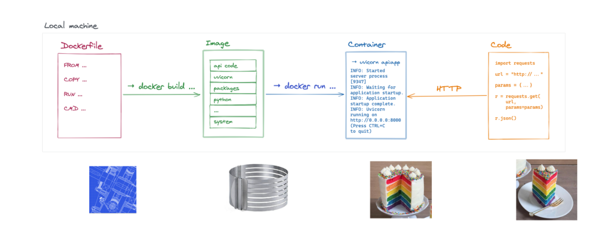

## backend:
`uvicorn backen:app --reload`
## frontend:
`streamlit run frontend.py`


# Building a Machine Learning Web Application

## Bilibili videos


:rocket: All code used in the videos can be found in this repository.

- Get Inspired! 
  - [Video 1 - Get Inspired!](https://www.bilibili.com/video/BV1244y1J7C7/)
- Streamlit 
  - [Video 2 - Training model with Jupyter notebook](https://www.bilibili.com/video/BV1Ri4y117Qh/)
  - [Video 3 - Using trained model with streamlit](https://www.bilibili.com/video/BV1Ju411R7Gy/)
- Deployment on local machine
    - [Video 4 - Local Deployment - Architecture](https://www.bilibili.com/video/BV1RS4y1r79Q/)
    - [Video 5 - Local Deployment - Backend & FastAPI & Uvicorn](https://www.bilibili.com/video/BV1aP4y1F7xs/)
    - [Video 6 - Local Deployment - Frontend & Streamlit](https://www.bilibili.com/video/BV1Lb4y1t7LK/)
    - [Video 7 - Local Deployment - Localhost Demo](https://www.bilibili.com/video/BV1vR4y1V7Gn/)
- Deployment on public cloud VM
  - [Video 8 - Cloud Deployment - Buy and connect to cloud VM](https://www.bilibili.com/video/BV1nZ4y1k7Nr/)
  - [Video 9 - Cloud Deployment - FastAPI & Backend](https://www.bilibili.com/video/BV1aS4y1F76w/)
  - [Video 10 - Cloud Deployment - Streamlit & Frontend](https://www.bilibili.com/video/BV1TR4y1j7fp/)
- Deployment with Docker
  - [Video 11 - Learning to use Docker](https://www.bilibili.com/video/BV1kL4y1g7Xd/)
  - [Video 12 - Cloud Deployment with Docker](https://www.bilibili.com/video/BV1wL411T7VB/)
  
## YouTube videos

- Streamlit
  - https://www.youtube.com/watch?v=R2nr1uZ8ffc
  - https://www.youtube.com/watch?v=sxLNCDnqyFc
  - https://www.youtube.com/watch?v=VtrFjkSGgKM
  - https://www.youtube.com/watch?v=z8vgmvtgxCs

- FastAPI
  - https://www.youtube.com/watch?v=kCggyi_7pHg

- Uvicorn
  - https://youtu.be/-ykeT6kk4bk?t=662

- Python ```requests``` package
  - https://www.youtube.com/watch?v=qriL9Qe8pJc
  


## Get Inspired!

- https://www.tensorflow.org/js
- https://streamlit.io/gallery
- https://playground.tensorflow.org
- https://maneprajakta.github.io/Digit_Recognition_Web_App/
- https://www.cs.ryerson.ca/~aharley/vis/fc/

:rocket: If you really struggle with coming up with good ideas, you could git clone a Jupyter notebook from GitHub and then deploy it as 
a web app.


## Streamlit


[Streamlit](https://www.streamlit.io/) is a 
data science oriented
application framework.

Its goal is to enable data 
scientists to release applications 
without requiring the assistance 
of a development team.

```Streamlit``` allows to build an 
app making predictions using 
a trained model, with very few 
lines of code handling the user 
interface and controls, and almost 
no design efforts.


#### How does it work?
Streamlit interprets the code of the app from top to bottom. Every elements encountered in the main script file are displayed in the interface one after the other

The elements may be simple variables (strings containing text or markdown), objects (dataframes are represented as tables), or more complex user controls (actions or inputs), charts, maps or third party graphs (matplotlib, plotly, etc)

Streamlit draws the output live in the browser, as a notebook would


#### API references
https://docs.streamlit.io/library/api-reference


#### A simple app
```python
import streamlit as st

import numpy as np
import pandas as pd

st.markdown("""# This is a header
## This is a sub header
This is text""")

df = pd.DataFrame({
          'first column': list(range(1, 11)),
          'second column': np.arange(10, 101, 10)
        })

# this slider allows the user to select a number of lines
# to display in the dataframe
# the selected value is returned by st.slider
line_count = st.slider('Select a line count', 1, 10, 3)

# and used in order to select the displayed lines
head_df = df.head(line_count)

head_df
```
#### Result


#### How to run the app?
```shell script
streamlit run app.py
```

When the command is ran, Streamlit starts a web server and opens a new tab in the web browser showing the app. This allows you to assess the content of the page while you code.

```Streamlit``` automatically reloads the page as soon as the code of the main script file changes and is saved, which is very handy


## FastAPI


#### FastAPI
- High performance python framework

- Easy to learn, fast to code

- Automatically generated documentation allowing to test the API endpoints easily.

```shell script
pip install fastapi
```

#### Root entry point
**FastAPI** uses python decorators in order to link 
the routes that the developers will query to the 
code of the endpoints. The code of the decorated 
function will be called whenever an HTTP request 
is received. The response will be returned as a 
JSON object to the code querying the API.

```python
from fastapi import FastAPI

app = FastAPI()

# define a root `/` endpoint
@app.get("/")
def index():
    return {"ok": True}
```


#### What if we run the code?
```shell script
python -m simple
```
Nothing happens...

We need to use a web server in order to listen to 
the web requests for the API and call the code of 
the corresponding endpoint !

We will use Uvicorn!

## Uvicorn


**[Unicorn](https://www.uvicorn.org/)** is a lightning fast web server for python.

**Uvicorn** listens to all the HTTP requests and calls 
the code decorated for the corresponding **FastAPI**
endpoints.

```shell script
pip install uvicorn
```

#### Let's run our API using the web server
**Uvicorn** requires as parameters the name of the python 
file to run (here simple.py) as well as the name of 
the variable inside of the file containing the 
instance of the FastAPI app (here the variable 
is called app, hence the supplied parameter simple:app).

```shell script
uvicorn simple:app --reload
```

Now we can browse to the root page of the 
API: http://localhost:8000/

## Prediction API use case

#### Documentation and tests
FastAPI provides automatically
generated documentation allowing
developers to simplify their integration
of the API. The endpoints of the API
can be easily
tested through dedicated pages.

Swagger documentation and tests:
- http://localhost:8000/docs

The /docs endpoint is powered by
[Swagger](https://github.com/swagger-api/swagger-ui)
and comes in very handy in order to test our API and verify that everything is working correctly. It is also
very useful for developers wanting to test our API.

#### Ask for prediction with ```requests```
We want to build an API to ask for a prediction. 
For example, how long (in minutes) is the queue 
at the entry of the Louvre museum for a given 
week day and time. To do so, our API should be 
able to accept an HTTP request with params:

```python
url = 'http://localhost:8000/predict'
params = {
    'day_of_week': 0, # 0 for Sunday, 1 for Monday, ... 
    'time': '14:00'
}
response = requests.get(url, params=params)
response.json()
#=> {wait: 64}
```

The ```requests.get(url, params=params)``` results 
in the HTTP request:

```
http://localhost:8000/predict?day_of_week=0&time=14:00
```

in which ```?day_of_week=0&time=14:00``` is called a query string.


#### ```/predict``` endpoint
Let's add a ```/predict``` endpoint to our API
```python
@app.get("/predict")
def predict():
    return {'wait': 64}
```

#### Query parameters
What if you want to pass parameters to the endpoint?

FastAPI provides a 
[simple way](https://fastapi.tiangolo.com/tutorial/query-params/)
to do so. 
You just need need to define the 
parameters you want to pass as the 
function parameters.

```python
@app.get("/predict")
def predict(day_of_week, time):
    # compute `wait_prediction` from `day_of_week` and `time`
    return {'wait': wait_prediction}
```

Query parameters are all ```str``` so you will 
need to deal with their conversions 
into the suitable data types!

## Deployment on public cloud VM


#### Why?
We want to enable any developer writing
code on a remote machine connected to
the Internet to interact with our program.

Now that we are able to run our API
on our machine, how can we push it
to production ?

#### ```ssh-keygen``` and ```~/.ssh/authorized_keys```
- https://www.digitalocean.com/community/tutorials/how-to-configure-ssh-key-based-authentication-on-a-linux-server
- https://askubuntu.com/questions/46424/how-do-i-add-ssh-keys-to-authorized-keys-file

#### ```scp```
- https://linuxize.com/post/how-to-use-scp-command-to-securely-transfer-files/

#### Python Simple HTTP Server
```shell script
python -m http.server 9000
```

#### ```ping``` and ICMP
- https://stackoverflow.com/questions/21981796/cannot-ping-aws-ec2-instance
- https://serverfault.com/questions/511738/why-cant-i-ping-my-freshly-set-up-amazon-web-service-ec2-instance

#### security group
- https://medium.com/geekculture/aws-article-6-security-groups-in-ec2-6aa6e9a1faf
- https://aviatrix.com/learn-center/cloud-security/aws-security-groups/

#### ```nohup``` and ```&```
- https://linuxize.com/post/linux-nohup-command/
- https://linuxize.com/post/how-to-run-linux-commands-in-background/

#### ```ps -e | grep ```, ```kill``` and ```killall```
- https://askubuntu.com/questions/852206/what-does-ps-efgrep-processname-mean
- https://www.linode.com/docs/guides/use-killall-and-kill-to-stop-processes-on-linux/

## Deployment with Docker


#### Install Docker on Ubuntu
https://docs.docker.com/engine/install/ubuntu/

```shell script
sudo apt install apt-transport-https ca-certificates curl software-properties-common
curl -fsSL https://download.docker.com/linux/ubuntu/gpg | sudo apt-key add -
sudo add-apt-repository "deb [arch=amd64] https://download.docker.com/linux/ubuntu `lsb_release -cs` test"
sudo apt update
sudo apt install docker-ce docker-ce-cli containerd.io
```

#### Install Docker on Windows and MacOS
If your Windows supports WSL (Windows Subsystem for Linux), you could 
install Docker on your Windows. See https://docs.docker.com/desktop/windows/install/

Or else, you could get a virtual machine of Ubuntu and install Docker
in the VM. Docker can be installed on your public cloud VM instance running
Ubuntu as well.

For MacOS, see https://docs.docker.com/desktop/mac/install/ 

#### :rocket: :rocket: :rocket: Best Tutorial for beginners
- https://docker-curriculum.com/


#### Docker Images
- Python: https://hub.docker.com/_/python
- hello-world: https://hub.docker.com/_/hello-world
- ubuntu: https://hub.docker.com/_/ubuntu

#### Terminology 


#### Dockerfile vs Image vs Container


- The ```Dockerfile``` is a document that lists all the commands that a user would run in order to build a Docker image.  You can see the Dockerfile as a ***blueprint*** for a layer cake mold.
- The ```Docker image``` holds all the files required in order to instantiate a Docker container. You can see the Docker image as a layer ***cake mold***.
- The ```Docker container``` hosts a running instance of your code. You can see the Docker container as a ***layer cake***.
- Our application will be consumed in different ways depending on its nature. A website will be consumed through a browser. An API will be consumed through code.    You can see the consumer of the application as receiving ***a piece of the layer cake***.

#### Docker Registry
- If your network isn't restricted: 
  - https://github.com/veggiemonk/awesome-docker#registry
- If your network is slightly restricted: 
  - https://www.cnblogs.com/logo-fox/p/7592138.html
  - https://www.daocloud.io/mirror

#### :rocket: [Copy Docker images from one host to another without using a repository](https://stackoverflow.com/questions/23935141/how-to-copy-docker-images-from-one-host-to-another-without-using-a-repository)

You will need to save the Docker image as a tar file:
```shell script
docker save -o <path for generated tar file> <image name>
```

Then copy your image to a new system with regular 
file transfer tools such as cp, scp or 
rsync. 
After that you will have to load the image into Docker:
```shell script
docker load -i <path to image tar file>
```

Other viable alternative methods can be found here: https://www.tutorialspoint.com/how-to-copy-docker-images-from-one-host-to-another-without-using-a-repository

#### :rocket: :rocket: :rocket: Using Tsinghua pip source


When installing pip packages, to have an accelerated network connection, use the Tsinghua pip source:
```shell script
pip install -i https://pypi.tuna.tsinghua.edu.cn/simple <PYTHON-PACKAGE>
```

For more info, visit:
- https://blog.csdn.net/kwame211/article/details/85773260
- https://www.jianshu.com/p/db28a66cb8db

#### :rocket: :rocket: :rocket: Using a pip cache directory in docker builds

Modify the ```Dockerfile```:
```docker
RUN --mount=type=cache,target=/root/.cache \
pip install -r requirements.txt
```

And before running ```docker build .```, set the ```DOCKER_BUILDKIT``` environment variable to ensure BuildKit is used:
```shell script
$ export DOCKER_BUILDKIT=1
```
Or simply:
```shell script
DOCKER_BUILDKIT=1 docker build .
```

For more info, visit:
- https://docs.docker.com/develop/develop-images/build_enhancements/#to-enable-buildkit-builds
- https://pythonspeed.com/articles/docker-cache-pip-downloads/
- https://stackoverflow.com/questions/58018300/using-a-pip-cache-directory-in-docker-builds


## [optional] Heroku, with and without Docker

## [optional] Automatic deployment with GitHub Webhook [TODO]


One naive and simple solution would be to use ```crontab``` for periodic pull from GitHub ([ref1](https://dpursanov.medium.com/automatic-deploy-using-git-72ddbc1785cf), 
[ref2](https://stackoverflow.com/questions/4414140/git-auto-pull-using-cronjob).

A better solution is to use GitHub WebHook:

- https://ansonvandoren.com/posts/deploy-hugo-from-github/
- https://yuluyan.com/posts/hugo-tutorial-2/

### FastAPI based solution

In this tutorial, instead of using an [Ubuntu software named "webhook"](https://github.com/adnanh/webhook),
we are going to develop, by ourselves, a Python based solution.

We use [**FastAPI**](https://testdriven.io/blog/moving-from-flask-to-fastapi) and **Uvicorn** for listening to incoming requests from GitHub.

## Debug

#### Debug Uvicorn & FastAPI from PyCharm
- https://fastapi.tiangolo.com/tutorial/debugging/

#### Debug Streamlit from PyCharm
- https://discuss.streamlit.io/t/version-1-5-0/21455/11
- https://stackoverflow.com/questions/60172282/how-to-run-debug-a-streamlit-application-from-an-ide

## Misc

#### Run Streamlit from PyCharm
- https://discuss.streamlit.io/t/run-streamlit-from-pycharm/21624

Simply Change Interpreter options:
```shell script
-m streamlit run
```
and then it's OK.


## Conclusion


Conclusion.

